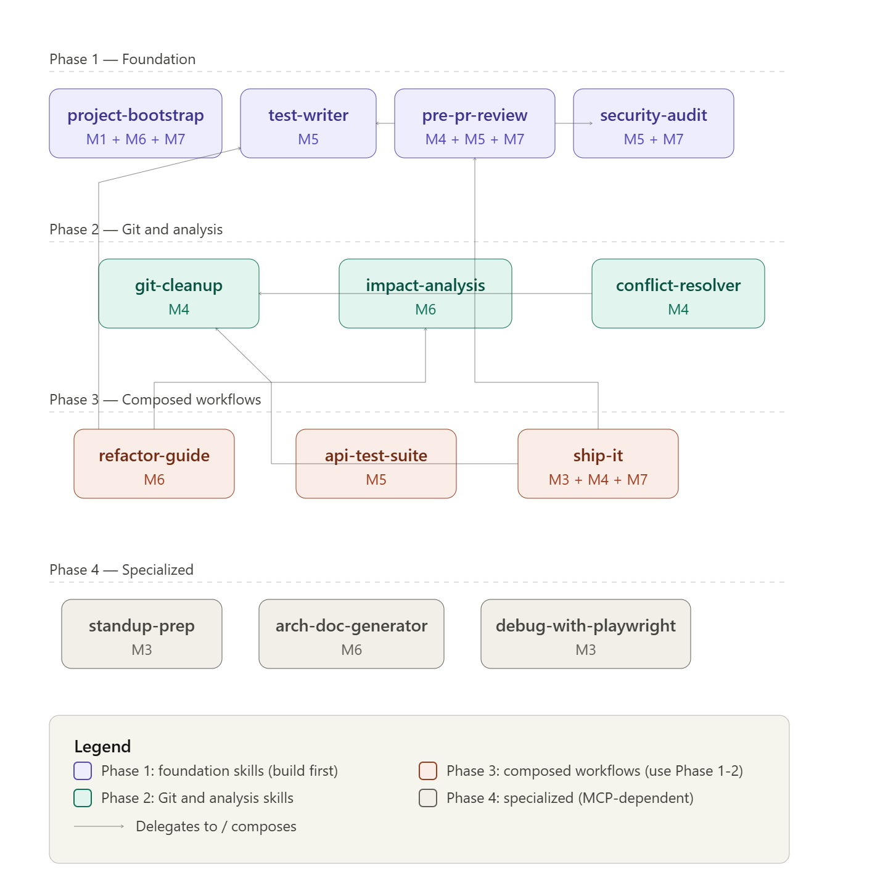

# Agent skills — how to use them

This folder holds **Claude / Cursor Agent Skills** for the training course: each subfolder is one skill, with a root **`SKILL.md`** (metadata + instructions for the agent) and usually a **`references/`** tree for checklists, stack files, and examples.

The **seven** course modules surface recurring workflows; we captured the most valuable ones as **thirteen** recommended skills, plus one **bonus** skill. Think of this set as a **baseline**: you can **copy** skills into a real project, **trim** what you do not need, and **extend** them with your own `references/`, `CLAUDE.md` rules, and MCP tools. Teams should align skill text with their **conventions** (base branch, Jira vs ADO, review policy) so the agent does not fight your process.

**Using skills in your tools:** Install locations depend on the host (e.g. user-level or project **`.claude/skills/`** in Claude Code, or your Cursor skills path). The agent typically **auto-invokes** a skill when your request matches its **description** in the YAML front matter; you can also name the skill or paste from its `SKILL.md` when you want a specific workflow. Connect **MCP** servers (GitHub, Jira, Azure DevOps, Slack, Playwright, etc.) as described in the [project root `README`](../README.md) so skills that depend on them can run end-to-end—or read the “fallback” notes inside each skill when a server is missing.

Exemplar **project rules** and **commands** in this repository live under [`templates/`](../templates/) and [`commands/`](../commands/) (one folder per **stack**). Skills often point to the matching `commands/<stack>/…` file for a concrete prompt you can run alongside the skill.



---

## Phase 1 — Foundation (start here)

These four skills are the default **first** skills to teach or wire up: almost every other flow assumes you can **navigate the repo**, **check quality before a PR**, **write tests**, and **audit security**.

### 1. `project-bootstrap` — [folder](project-bootstrap/)

|                  |                                                                                                                                                                                                                                                                                                                  |
| ---------------- | ---------------------------------------------------------------------------------------------------------------------------------------------------------------------------------------------------------------------------------------------------------------------------------------------------------------- |
| **When to use**  | You are **new** to a repository, or you need a single **source of truth** for how the app is built, tested, and structured.                                                                                                                                                                                      |
| **What to say**  | _“Onboard me,” “What does this codebase do?,” “Generate a `CLAUDE.md`”_ (Cursor users often mirror the same file as **`.cursorrules`**).                                                                                                                                                                         |
| **What you get** | A load-bearing **`CLAUDE.md`**, stack detection, a traced **happy path**, red flags, and a short **onboarding** section.                                                                                                                                                                                         |
| **In this repo** | [`project-bootstrap/SKILL.md`](project-bootstrap/SKILL.md), [`references/stacks/`](project-bootstrap/references/stacks/) (seven stacks), [`architecture-patterns.md`](project-bootstrap/references/architecture-patterns.md). Exemplar CLAUDE files: [`templates/<stack>/`](../templates/). **Modules 1, 6, 7.** |

### 2. `pre-pr-review` — [folder](pre-pr-review/)

|                  |                                                                                                                                                                        |
| ---------------- | ---------------------------------------------------------------------------------------------------------------------------------------------------------------------- |
| **When to use**  | Before you open or merge a **PR**; you want lint, tests, diff review, and a **P0–P2** report.                                                                          |
| **What to say**  | _“Pre-PR check,” “Is this ready for review?,” “Review my changes”_ — align with [`commands/<stack>/pre-pr.md`](../commands/).                                          |
| **What you get** | Stack-ordered **gates**, security and quality checklists, commit-message checks, and an optional **PR draft** if you ask.                                              |
| **In this repo** | [`pre-pr-review/SKILL.md`](pre-pr-review/SKILL.md), shared checklists and **seven** [`references/stacks/*.md`](pre-pr-review/references/stacks/). **Modules 4, 5, 7.** |

### 3. `test-writer` — [folder](test-writer/)

|                  |                                                                                                                                                          |
| ---------------- | -------------------------------------------------------------------------------------------------------------------------------------------------------- |
| **When to use**  | You need **unit** or **integration** tests, **TDD**, **characterization** tests on legacy code, or to **close coverage** gaps.                           |
| **What to say**  | _“Write tests for…,” “TDD this,” “Characterization tests for…,” “Increase coverage on…”_                                                                 |
| **What you get** | Idiomatic tests that match the project’s **framework** and **patterns**; modes for new code vs legacy.                                                   |
| **In this repo** | [`test-writer/SKILL.md`](test-writer/SKILL.md), language helpers and **seven** [`references/stacks/*.md`](test-writer/references/stacks/). **Module 5.** |

### 4. `security-audit` — [folder](security-audit/)

|                  |                                                                                                                                                                                                                |
| ---------------- | -------------------------------------------------------------------------------------------------------------------------------------------------------------------------------------------------------------- |
| **When to use**  | Ad-hoc or release **security** review, OWASP-style pass, or **dependency** risk on changed code.                                                                                                               |
| **What to say**  | _“Security scan,” “OWASP check,” “Audit this for vulnerabilities”_ — pair with [`commands/<stack>/security-scan.md`](../commands/) if present.                                                                 |
| **What you get** | A prioritized **findings** list with **severity**, locations, and **fixes**; stack-specific headers and **secrets** patterns.                                                                                  |
| **In this repo** | [`security-audit/SKILL.md`](security-audit/SKILL.md), `owasp-top10-checklist.md`, `references/language-specific/*`, **seven** [`references/stacks/*.md`](security-audit/references/stacks/). **Modules 5, 7.** |

---

## Phase 2 — Git and analysis

Use these when **history** is messy, **merges** conflict, or you need **blast radius** before a change.

### 5. `git-cleanup` — [folder](git-cleanup/)

|                  |                                                                                                                  |
| ---------------- | ---------------------------------------------------------------------------------------------------------------- |
| **When to use**  | Many WIP or fixup commits; you want a **clean** Conventional **history** before a PR.                            |
| **What to say**  | _“Clean up my branch,” “Squash / interactive rebase,” “Prepare for merge”_                                       |
| **What you get** | A proposed **rebase** plan, **backup** ref, and **verify** step—**Git only**, no app stack.                      |
| **In this repo** | [`git-cleanup/SKILL.md`](git-cleanup/SKILL.md), `conventional-commits.md`, `rebase-strategies.md`. **Module 4.** |

### 6. `conflict-resolver` — [folder](conflict-resolver/)

|                  |                                                                                                                                                      |
| ---------------- | ---------------------------------------------------------------------------------------------------------------------------------------------------- |
| **When to use**  | **Merge** or **rebase** **conflicts**; you need intent-aware resolution and **tests** after.                                                         |
| **What to say**  | _“Resolve these conflicts,” “Rebase hit conflicts”_                                                                                                  |
| **What you get** | Triage, **merge** strategies, batch resolution, report (often with **`git-cleanup`** in the same session).                                           |
| **In this repo** | [`conflict-resolver/SKILL.md`](conflict-resolver/SKILL.md), [`merge-strategies.md`](conflict-resolver/references/merge-strategies.md). **Module 4.** |

### 7. `impact-analysis` — [folder](impact-analysis/)

|                  |                                                                                                                                                                                     |
| ---------------- | ----------------------------------------------------------------------------------------------------------------------------------------------------------------------------------- |
| **When to use**  | Before a **refactor** or public API change: _what breaks_, **who** imports this, **phasing** advice.                                                                                |
| **What to say**  | _“What will break if I change X?,” “Blast radius,” “Who depends on this?”_                                                                                                          |
| **What you get** | **Consumer** graph, **dynamic** references, risk and **phased** recommendation.                                                                                                     |
| **In this repo** | [`impact-analysis/SKILL.md`](impact-analysis/SKILL.md), `dependency-tracing-strategies.md`, **seven** [`references/stacks/*.md`](impact-analysis/references/stacks/). **Module 6.** |

---

## Phase 3 — Composed workflows

These **chain** Phase 1–2: **deeper** API testing, **guided** refactors, and **end-to-end ship**.

### 8. `api-test-suite` — [folder](api-test-suite/)

|                  |                                                                                                                                              |
| ---------------- | -------------------------------------------------------------------------------------------------------------------------------------------- |
| **When to use**  | You want **Postman-**style or **HTTP**-level coverage of **endpoints** and **workflows** (not only unit tests).                              |
| **What to say**  | _“Test my API,” “Build a collection for these routes,” “Contract / workflow tests”_                                                          |
| **What you get** | Organized **suites**, schema checks, **optional** Postman MCP.                                                                               |
| **In this repo** | [`api-test-suite/SKILL.md`](api-test-suite/SKILL.md), **seven** [`references/stacks/*.md`](api-test-suite/references/stacks/). **Module 5.** |

### 9. `refactor-guide` — [folder](refactor-guide/)

|                  |                                                                                                                                                                                                                                |
| ---------------- | ------------------------------------------------------------------------------------------------------------------------------------------------------------------------------------------------------------------------------ |
| **When to use**  | **Large** refactors: **extract** types, **replace** a library, **framework** upgrade, **strangler** patterns.                                                                                                                  |
| **What to say**  | _“Refactor this module,” “Migrate from X to Y,” “Framework upgrade”_ — combine with **impact** + **tests** first.                                                                                                              |
| **What you get** | **Phased** plan, **safety** checklist, pattern file (`extract-class`, `library-replacement`, etc.).                                                                                                                            |
| **In this repo** | [`refactor-guide/SKILL.md`](refactor-guide/SKILL.md), `refactoring-patterns/*`, **seven** [`references/stacks/*.md`](refactor-guide/references/stacks/). Pairs with **`impact-analysis`** and **`test-writer`**. **Module 6.** |

### 10. `ship-it` — [folder](ship-it/)

|                  |                                                                                                                                                             |
| ---------------- | ----------------------------------------------------------------------------------------------------------------------------------------------------------- |
| **When to use**  | You want to go from **staged** work to **pushed** branch, **open PR**, optional **Jira/ADO** link, optional **Slack**—without skipping the **pre-PR** gate. |
| **What to say**  | _“Ship it,” “Create PR,” “Push and open a PR”_ — Jira/ADO team vocabulary in [`ship-jira.md` / `ship-ado.md`](../commands/).                                |
| **What you get** | **Delegates** to **`pre-pr-review`**, optional **`git-cleanup`**, then **commit** / **push** / **PR** / **notify**.                                         |
| **In this repo** | [`ship-it/SKILL.md`](ship-it/SKILL.md), `conventional-commit.md`, `integrations.md`. **Modules 3, 4, 7.**                                                   |

---

## Phase 4 — Specialized (MCP or narrow)

These are **high value** in the right context: **day-to-day** status, **docs** from code, **browser** debugging.

### 11. `standup-prep` — [folder](standup-prep/)

|                  |                                                                                                                                                                        |
| ---------------- | ---------------------------------------------------------------------------------------------------------------------------------------------------------------------- |
| **When to use**  | **Standup** or **async** daily: yesterday / today / blockers from **git** + **tracker** + **PRs**.                                                                     |
| **What to say**  | _“Prepare my standup,” “What did I do yesterday?,” “Daily update”_                                                                                                     |
| **What you get** | Short **copy-paste** text; **Slack** only if you **ask** and approve. **Requires** a **work-item** (Jira/ADO) + **git**; degrades with **Fallback** in the references. |
| **In this repo** | [`standup-prep/SKILL.md`](standup-prep/SKILL.md), `standup-format.md`, `mcp-queries.md`. **Module 3.**                                                                 |

### 12. `arch-doc-generator` — [folder](arch-doc-generator/)

|                  |                                                                                                                                   |
| ---------------- | --------------------------------------------------------------------------------------------------------------------------------- |
| **When to use**  | You need an **ADR**, **module** map, **data-flow** note, **debt** list, or **onboarding** doc **grounded** in the **repo**.       |
| **What to say**  | _“Document the architecture,” “Generate an ADR,” “Technical debt from the code”_                                                  |
| **What you get** | Cited, **verifiable** Markdown; reuses **impact** / **bootstrap** ideas without duplicating seven **stack** files in this folder. |
| **In this repo** | [`arch-doc-generator/SKILL.md`](arch-doc-generator/SKILL.md), `adr-template.md`, `artifacts.md`, `validation.md`. **Module 6.**   |

### 13. `debug-with-playwright` — [folder](debug-with-playwright/)

|                  |                                                                                                                                                                                                                         |
| ---------------- | ----------------------------------------------------------------------------------------------------------------------------------------------------------------------------------------------------------------------- |
| **When to use**  | **UI** bugs, **layout**, **repro** in a real **browser**; you have or can start a **dev server**.                                                                                                                       |
| **What to say**  | _“Debug in the browser,” “Screenshot this page,” “What happens when I click…?”_                                                                                                                                         |
| **What you get** | **Repro** steps, **screenshots**, **console** / **network** signals; **optional** code fix and **re-verify**. Falls back to **manual** steps if the MCP is missing.                                                     |
| **In this repo** | [`debug-with-playwright/SKILL.md`](debug-with-playwright/SKILL.md), `mcp-and-fallbacks.md`, `report-template.md`. Ties to **pre-PR** optional Playwright in [`commands/<stack>/pre-pr.md`](../commands/). **Module 3.** |

---

## Bonus — `prep-sprint-work` (Skill 14)

### 14. `prep-sprint-work` — [folder](prep-sprint-work/)

|                  |                                                                                                                                                                                                                                                                                                                                                                                                 |
| ---------------- | ----------------------------------------------------------------------------------------------------------------------------------------------------------------------------------------------------------------------------------------------------------------------------------------------------------------------------------------------------------------------------------------------- |
| **When to use**  | You are **preparing** a **sprint** or **story** **before** implementation: **Jira/ADO** **intake** (or you **paste** work-item **keys**), a **plan-mode** **architecture** **review**, **ADR** / arch **doc** updates, and a **documentation-only** **PR** for review (feature code in **follow-up** work unless the user **expands** scope). This skill is **not** one of the **original 13**. |
| **What to say**  | _“Prep my sprint work,” “Prepare this story,” “Start feature prep,” “Pull PROJ-123 and plan the architecture”_ — align with tracker vocabulary and [`prep-sprint-work/references/mcp-work-items.md`](prep-sprint-work/references/mcp-work-items.md) when MCP is missing.                                                                                                                        |
| **What you get** | **Ingested** requirements, **grounded** codebase research, **explicit** architecture **decisions**, **updated** **ADR** / **architecture** **docs**, an **implementation** plan with a **dependency** **graph**, and a **docs** **PR** (defaults to **no** application code in the same run).                                                                                                   |
| **In this repo** | [`prep-sprint-work/SKILL.md`](prep-sprint-work/SKILL.md), `references/` (planning, MCP **fallbacks**). Composes **`arch-doc-generator`**, **`impact-analysis`**, and **`ship-it`**. **Modules 3, 6, 7.**                                                                                                                                                                                        |

---

## How skills combine (dependency map)

Skills **delegate** to each other by **name**—keep each `SKILL.md` small and use **other** skills for shared behavior:

```
project-bootstrap
  └── produces CLAUDE.md context for later work

ship-it
  ├── pre-pr-review (quality gate)
  └── git-cleanup (optional, clean history)

pre-pr-review
  │  (in spirit: security and test depth align with)
  ├── security-audit
  └── test-writer

refactor-guide
  ├── impact-analysis
  └── test-writer

arch-doc-generator
  ├── impact-analysis
  └── project-bootstrap (patterns, structure)

debug-with-playwright
  ├── pre-pr-review (verify after fix)
  └── test-writer (e2e regression)

prep-sprint-work
  ├── Jira / ADO (or user paste)
  ├── arch-doc-generator, impact-analysis
  └── ship-it (docs PR only, by default)

conflict-resolver
  └── git-cleanup (rebase/merge in flight)
```

Mastering **project-bootstrap**, **pre-pr-review**, **test-writer**, and **security-audit** first gives a **strong base** for everything else.

---

## Suggested order to learn or roll out

1. **Foundation** — `project-bootstrap` → `test-writer` → `pre-pr-review` → `security-audit` (order is flexible; many teams start with `pre-pr-review` + `test-writer`).
2. **Git and analysis** — `git-cleanup` → `impact-analysis` → `conflict-resolver` as needed.
3. **Composed** — `refactor-guide` → `api-test-suite` → `ship-it`.
4. **Specialized** — add `standup-prep`, `arch-doc-generator`, and `debug-with-playwright` when your **MCP** set matches.
5. **Bonus** — `prep-sprint-work` when the team **plans** in **Jira/ADO** and **reviews** **docs** before large features.

---

## Adapting, extending, and governing skills

- **Progressive disclosure** — Language- or stack-heavy skills use a **compact** `SKILL.md` plus `references/`: the agent should **read the stack file** for the project type (e.g. `references/stacks/<id>.md`) and **not** load every language at once.
- **Composition** — Prefer **“use skill X for step Y”** over **copy-paste** checklists, so one fix updates every consumer.
- **MCP** — **ship-it**, **standup-prep**, **debug-with-playwright**, and **prep-sprint-work** (Jira/ADO) expect tools **sometimes**; each skill’s references describe **degraded** behavior when a server is absent.
- **Anti-patterns** — Each skill’s **`SKILL.md`** should keep an **anti-patterns** section: those guardrails are teaching material, not optional fluff.
- **Your project** — **Fork** skills, add a **`references/<your-team>.md`** for JIRA project keys and **branch** policy, or **narrow** the description field so the agent only invokes a skill in the **right** repo. The skills here are **intentionally** generic; production teams usually **tighten** triggers and add **compliance** steps.

---

## Quick index

| Skill                      | Folder                                           |
| -------------------------- | ------------------------------------------------ |
| `project-bootstrap`        | [project-bootstrap/](project-bootstrap/)         |
| `pre-pr-review`            | [pre-pr-review/](pre-pr-review/)                 |
| `test-writer`              | [test-writer/](test-writer/)                     |
| `security-audit`           | [security-audit/](security-audit/)               |
| `git-cleanup`              | [git-cleanup/](git-cleanup/)                     |
| `conflict-resolver`        | [conflict-resolver/](conflict-resolver/)         |
| `impact-analysis`          | [impact-analysis/](impact-analysis/)             |
| `api-test-suite`           | [api-test-suite/](api-test-suite/)               |
| `refactor-guide`           | [refactor-guide/](refactor-guide/)               |
| `ship-it`                  | [ship-it/](ship-it/)                             |
| `standup-prep`             | [standup-prep/](standup-prep/)                   |
| `arch-doc-generator`       | [arch-doc-generator/](arch-doc-generator/)       |
| `debug-with-playwright`    | [debug-with-playwright/](debug-with-playwright/) |
| `prep-sprint-work` (bonus) | [prep-sprint-work/](prep-sprint-work/)           |
