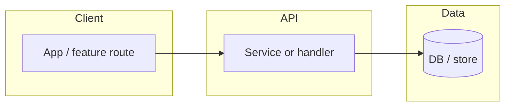

# Implementation plan and dependency graph

## Document structure (Markdown)

Use a single file such as `docs/implementation/plan-<KEY>-<YYYYMMDD>.md` (path must match the repo) or a section in the main PR **description** if the team keeps plans only in the tracker.

**Sections (suggested):**

1. **Context** — work item key(s), link, **goal** in one short paragraph.
2. **Acceptance criteria (traceability)** — table: **AC** (quote or paraphrase) | **proposed** verification (test level, e2e, API test).
3. **Architecture decisions (locked)** — bullet per decision; **link** to the **ADR** in the same branch. If **no** new ADR, state “N/A, existing only.”
4. **Proposed** changes (high level) — **by** layer: UI, **API**, domain, data, **infra** (no huge code dump).
5. **Risks** — and mitigations.
6. **Phased** rollout (if any) — flags, migrations, backward compatibility.
7. **Out of scope** for this plan — explicit.
8. **Open questions** — TBD.
9. **Dependency** **graph** — Mermaid (below) and/or a **From → To** table with file or package evidence.

**Metadata** footer: date, work item key(s), branch; align with [`arch-doc-generator/references/validation.md`](../../arch-doc-generator/references/validation.md) if embedded in a generated **doc** block.

## Mermaid: affected modules, services, components

Prefer **Mermaid** `flowchart` or `graph` when the user’s **Markdown** renderer supports it; otherwise a **table**.

- **Name** real **node** labels with **package**, **project folder**, or **class** (as evidence allows). **Dashed** edges for **optional** or _planned_ couplings.
- For **monorepos**, one subgraph per **package** or app. For **events**, add **Event bus** and **subscribers** if present in code.
- **Legend:** solid = current dependency; dashed = _new_ or _changed_ in this work (say which in a caption).
- If the graph is **uncertain**, label nodes **(TBD)** and list **spikes** in **Open questions**.

## Size

Keep the Mermaid **small** (under **~20** nodes) so it stays **reviewable**; split with a **“Detail: PROJ-123-API”** sub-diagram in a child section if needed.
